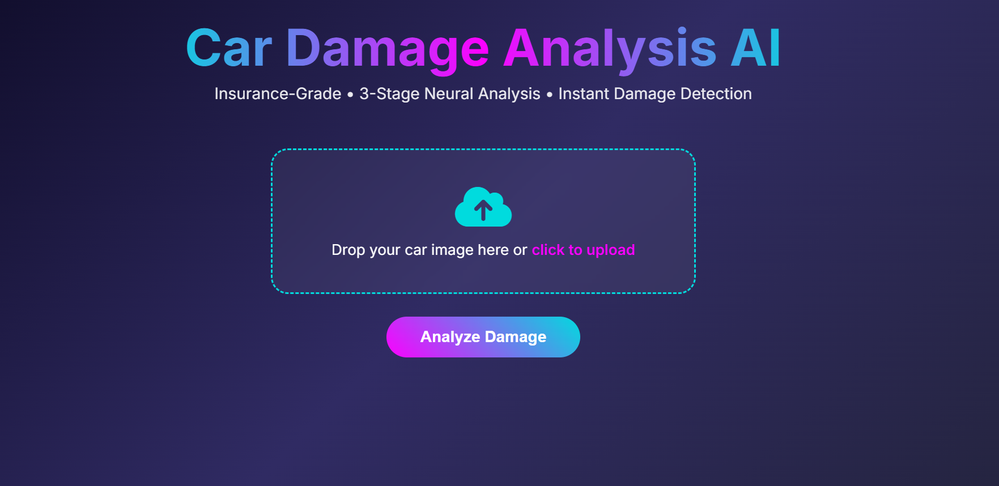
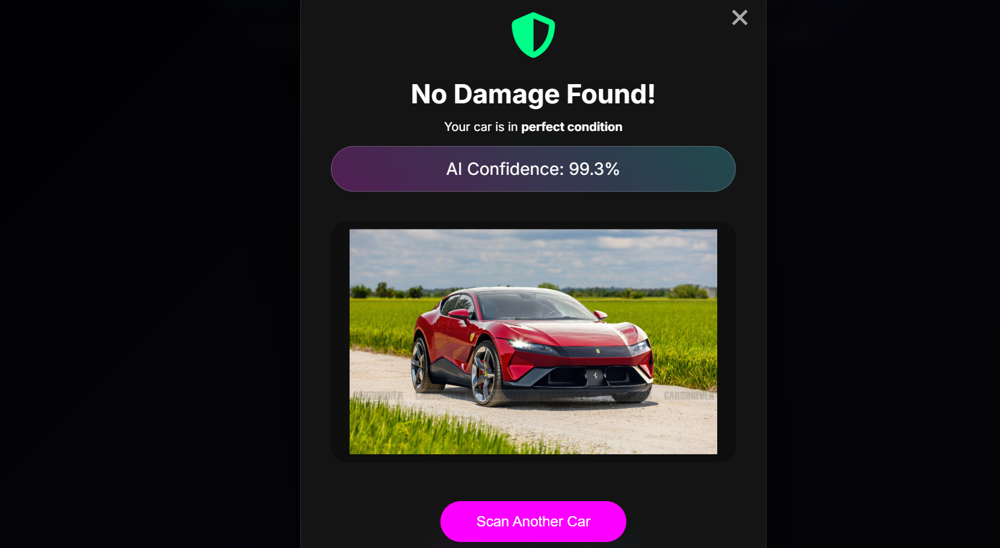
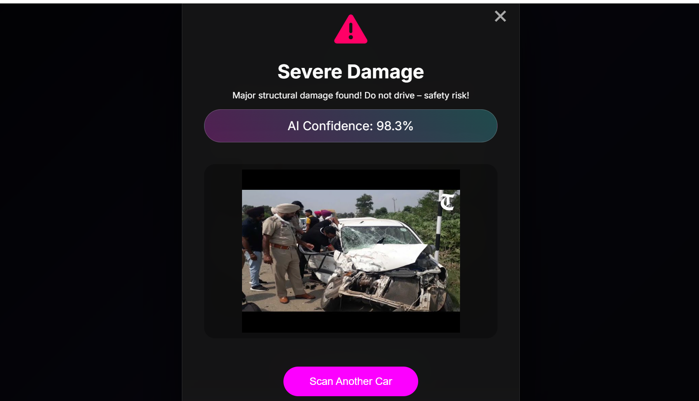

### 🚀 Project Overview
**CarDamageAnalysis AI** is a **full-stack, production-grade computer vision system** that analyzes a single car photo and instantly returns:
- Whether it contains a car
- If the car is damaged
- Damage severity: **Minor**, **Moderate**, or **Severe**
- Overall AI confidence score

Built for **insurance claims automation**, **used car valuation**, **rental inspection**, and **repair estimation** — solving a **$10B+ global market**.

### Live Url : https://nirmal-patel-car-damage-analysis-ai.hf.space/

---

### 🎨 Screenshots & Demo

| Upload Screen                  | Result Modal (No Damage)           | Result Modal (Severe Damage)         |
|-------------------------------|-------------------------------------|---------------------------------------|
|   |          |          |


---

### 🧠 The 3-Stage AI Pipeline (All EfficientNet-B3 Transfer Learning)

| Stage | Model Name                        | Dataset Size       | Classes                  | Accuracy | Trained On        |
|------|-----------------------------------|--------------------|--------------------------|----------|-------------------|
| 1    | `car_or_not_predictor.keras`      | 46,000 images      | Car / Not Car            | 99.1%    | Custom + Stanford Cars |
| 2    | `car_damage_detection.keras`     | 6,000 images       | Damaged / Undamaged      | 97.8%    | Kaggle + Custom        |
| 3    | `how_much_damage_model.keras`     | 15,000 images      | Minor / Moderate / Severe| 94.6%    | Custom Annotated       |

> All models use **EfficientNet-B3** with **ImageNet pretrained weights** → fine-tuned on real-world car photos.

---

### 📊 Datasets Used

| Dataset                     | Size       | Source                                    | Link |
|----------------------------|------------|-------------------------------------------|------|
| Car vs Not Car             | 46,000     | Stanford Cars + Open Images + Custom      | [Kaggle + Custom](https://www.kaggle.com/datasets/nirmalpatel02/car-and-some-random-image) |
| Damaged vs Undamaged Cars  | 6,000      | Kaggle Car Damage Dataset                 | (Private on request) |
| Severity Classification    | 15,000     | Manually annotated (Minor/Moderate/Severe)| [Kaggle](https://www.kaggle.com/datasets/nirmalpatel02/damagedcarswithsavarity) |


---

### 🛠 Tech Stack

| Layer             | Technology                                 |
|------------------|---------------------------------------------|
| Backend           | FastAPI (async, production-ready)           |
| ML Framework      | TensorFlow 2.13 + Keras                     |
| Models            | EfficientNet-B3 (Transfer Learning)         |
| Frontend          | Jinja2 + Vanilla JS + CSS     |
| Image Handling    | Base64 encoding (no file serving issues)    |
| Deployment Ready  | HuggingFace                      |

---

### ⚡ Key Features

- Click-anywhere drag & drop upload
- Real-time image preview
- Smart loading states (first load warning)
- Single **Overall AI Confidence** score
- No scroll modal — perfect fit on all screens
- Mobile responsive
- Cross button always visible
- "Scan Another Car" button centered

---

### 🚀 Real-World Applications

| Industry                | Use Case                                   | Companies Doing This         |
|-------------------------|--------------------------------------------|------------------------------|
| Insurance               | Auto claim automation & fraud detection    | Tractable ($1B+), CCC        |
| Used Cars               | Instant valuation & pricing                | Cars24, CarDekho, Spinny     |
| Rental Platforms        | Return damage inspection                   | Zoomcar, Turo                |
| Repair Shops            | Instant repair cost estimation             | Body shops, dealerships      |
| Autonomous Vehicles     | Post-accident damage logging              | Tesla, Waymo                 |

---

### 🏃‍♂️ How to Run Locally

```bash
# Clone repo
git clone https://github.com/NirmalPatel-02/CarDamageDetector
cd CarDamageDetector

# Install dependencies
pip install -r requirements.txt

# Run server
uvicorn app:app --host 0.0.0.0 --port 8000 --reload
